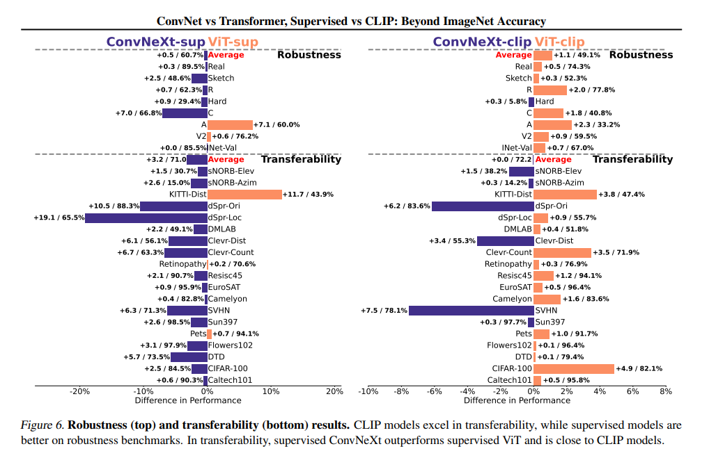

![[attachment/Portfolio/singer_town.jpg]]

## 1. 프로젝트 개요

최근 AI 모델의 성능은 단일 모델의 구조적 완성도를 넘어, **내부 모듈을 어떻게 구성하고 조합하느냐에 따라 결정되고 있다.** 특히 멀티모달 모델에서는 서로 다른 모달리티 간의 표현을 동일한 공간에서 정렬하고 결합하는 방식이 성능을 좌우하는 핵심 요소로 작용한다.

본 프로젝트는 모델 간의 단순 성능 비교를 넘어, **구조적 설계와 임베딩 방식의 차이가 모델의 이해 능력에 어떤 영향을 미칠 수 있는지를 분석하는 것을 목표**로 한다. 이를 위해 이미지와 텍스트를 통합된 임베딩 공간에서 처리하는 **One-tower VLM 구조**에 주목하였다.

One-tower 구조는 두 모달리티를 동일한 표현 공간 내에서 학습시켜 이미지–텍스트 간의 직접적인 관계성을 포착할 수 있으며, 파라미터 공유를 통해 연산 효율성과 모델 경량화 측면에서도 장점을 가진다. 본 프로젝트에서는 이러한 특성을 지닌 **CLIPPO 모델**을 기반으로, **통합 임베딩 구조는 유지한 채 이미지 인코더의 구성 요소를 변경함으로써**, 하위 모듈의 구조적 차이가 모델의 표현 특성과 성능 경향에 어떤 영향을 미칠 수 있는지를 이론적으로 분석하고 가설을 설정하였다.

## 2. 연구 접근 및 설계

### 1) ViT와 ConvNeXt의 구조적 차이

ViT와 ConvNeXt는 모두 이미지를 패치 단위로 처리한다는 공통점을 가지지만, **패치 임베딩 방식과 네트워크 구조에서 본질적인 차이**를 보인다. 이러한 차이는 이미지 정보를 해석하고 표현하는 방식에 영향을 미치며, 멀티모달 모델에서 이미지–텍스트 정렬 특성에도 서로 다른 경향을 만들 수 있다.

### ViT (Vision Transformer)

- ViT는 이미지를 일정 크기의 패치로 분할한 뒤, 각 패치를 선형 투영을 통해 고차원 벡터로 변환하고 위치 인코딩을 추가한다. 이를 통해 트랜스포머 구조가 패치 간의 상대적 위치 정보를 인식할 수 있도록 한다.
- 이후 트랜스포머 블록을 활용하여 패치 간의 전역적인 관계를 학습하며, 셀프 어텐션 메커니즘을 통해 이미지 전체의 구조적 맥락을 포착한다.

### ConvNeXt

- ConvNeXt는 전통적인 CNN 기반 구조를 따르며, 합성곱 연산을 통해 이미지의 국소적 패턴과 질감 정보를 점진적으로 추출한다.
- ViT의 설계 철학을 일부 반영하여 기존 CNN 구조를 단순화하였으며, 깊은 네트워크를 통해 고수준 특징을 안정적으로 학습할 수 있도록 설계되었다.

## 3. CLIP-ViT vs CLIP-ConvNeXt

### CLIP 환경에서의 Backbone 차이

    

<strong>(ConvNet vs Transformer, Supervised vs CLIP: Beyond ImageNet Accuracy)</strong>

<strong>ConvNet과 Transformer 기반 모델의 차이는 supervised 학습 환경뿐 아니라, 멀티모달 대조 학습 기반의 CLIP 환경에서도 성능 특성의 차이로 관찰된다.</strong>

<strong>기존 연구 ConvNet vs Transformer, Supervised vs CLIP: Beyond ImageNet Accuracy에서는 CLIP으로 학습된 ViT와 ConvNeXt 모델을 비교하여, 멀티모달 통합 임베딩 구조 안에서도 이미지 인코더의 구조적 특성이 완전히 상쇄되지 않음을 보고하였다.</strong>

해당 연구에 따르면, **ViT 기반 CLIP 모델은 전이 학습과 zero-shot 분류 성능에서 상대적으로 강점을 보이는 반면**, **ConvNeXt 기반 CLIP 모델은 노이즈, 왜곡, 스케치와 같은 환경에서 더 높은 robustness를 보이는 경향**을 나타냈다. 

이는 이미지와 텍스트가 **서로 다른 인코더를 거치더라도, 대조 학습을 통해 동일한 표현 공간으로 매핑되는 CLIP 구조에서도** 이미지 인코더의 구조적 특성이 모델의 표현 방식과 성능 경향에 의미 있는 영향을 미칠 수 있음을 시사한다.

이러한 결과는 **CLIP과 같이 이미지와 텍스트가 서로 다른 인코더를 통해 생성된 임베딩이 공통 표현 공간에서 정렬되도록 학습되는 환경에서도, 이미지 인코더의 설계 방식이 모델의 전반적인 특성에 의미 있는 영향을 미친다는 점을 보여준다.**

## 4. CLIPPO-ViT vs CLIPPO-ConvNeXt

### One-tower VLM 환경에서의 구조적 차이에 대한 가설

CLIP 환경에서도 backbone에 따른 성능 경향의 차이가 관찰되었다면, 이미지와 텍스트를 더욱 강하게 통합하는 One-tower 구조의 **CLIPPO 환경에서는 이러한 차이가 어떻게 나타날지에 대한 질문이 자연스럽게 제기된다.** CLIPPO는 이미지와 텍스트를 동일한 인코더와 임베딩 공간에서 처리하는 구조로, 두 모달리티 간의 표현 정렬이 더욱 밀접하게 이루어진다는 특징을 가진다.

본 프로젝트에서는 이러한 CLIPPO의 구조적 특성을 유지한 채, 이미지 인코더를 ViT와 ConvNeXt로 각각 구성했을 때 나타날 수 있는 표현 특성과 성능 경향의 차이에 주목하였다. ViT와 ConvNeXt는 이미지 정보를 해석하는 방식에서 차이를 가지므로, 이러한 구조적 특성이 통합 임베딩 환경에서도 서로 다른 경향으로 반영될 수 있다고 가설을 설정하였다.

구체적으로, **ViT 기반 CLIPPO 모델은 전역적인 관계 학습**에 강점을 가지므로 추상적인 개념 매칭이나 복잡한 텍스트-이미지 정렬 상황에서 유리할 가능성이 있으며, **ConvNeXt 기반 CLIPPO 모델은 국소 패턴**과 경계 정보를 안정적으로 포착하는 특성으로 인해 노이즈나 왜곡이 포함된 환경에서 더 견고한 표현을 형성할 가능성이 있다고 판단하였다.

비록 대규모 멀티모달 데이터 수집 및 pretraining 리소스의 한계로 인해 해당 가설을 실험적으로 검증하지는 못했지만, **본 분석은 통합 임베딩 구조에서도 하위 모듈의 설계 방식이 모델 특성에 영향을 미칠 수 있다는 점을 이론적으로 확장하여 제시한다는 데 의의가 있다.** 이는 최근 멀티모달 모델 연구에서 강조되고 있는 하위 모듈 조합과 구조적 설계의 중요성을 One-tower VLM 관점에서 재해석한 시도로 볼 수 있다.

## 5. 회고 및 배운 점

본 프로젝트는 One-tower VLM 구조에서 하위 모듈의 조합이 모델 특성에 미치는 영향을 분석하고자 한 연구 설계 중심의 프로젝트였다. 그러나 연구를 구체화하는 과정에서, **대규모 멀티모달 데이터 수집과 pretraining이 개인 연구 환경에서는 현실적으로 가장 큰 제약 요소라는 점을 명확히 인식하게 되었다**. 데이터 수집 방법론과 모델 학습 전략은 문헌을 통해 충분히 검토할 수 있었으나, 이를 실제로 실행하기에는 컴퓨팅 리소스와 시간 측면에서 한계가 존재하였다.

이로 인해 본 프로젝트는 실험 중심의 접근 대신, 기존 연구 결과를 바탕으로 한 **이론적 분석과 가설 설정 중심의 연구로 전환**되었다. 이 과정에서 단순히 모델 구조를 비교하는 것이 아니라, **통합 임베딩 환경에서도 이미지 인코더의 구조적 특성이 모델의 표현 방식과 성능 경향에 영향을 미칠 수 있다는 점**을 기존 CLIP 계열 연구를 통해 논리적으로 확장해 나갈 수 있었다.

특히, 본 프로젝트를 통해 최근 멀티모달 모델의 성능 향상은 새로운 구조를 설계하는 것보다도, **하위 모듈을 어떻게 조합하고 어떤 특성을 가진 표현을 통합하는지가 핵심적인 요소로 작용한다는 관점**을 명확히 정립할 수 있었다. 이는 모델을 단순히 구현하거나 비교하는 단계에서 나아가, **모델 설계를 해석하고 설명하는 관점**을 갖추는 계기가 되었다.

또한 **연구 초기 단계에서 데이터 규모, 학습 방식, 컴퓨팅 리소스와 같은 현실적인 제약 조건을 선제적으로 고려하는 것이 연구의 완성도에 직결된다는 점을 경험적으로 학습하였다.** 이는 이후 연구나 프로젝트를 설계할 때, 문제의 난이도뿐만 아니라 실행 가능성까지 함께 고려하는 기준을 형성하는 데 중요한 기준점이 되었다.

비록 실험을 통한 정량적 결과를 도출하지는 못했지만, 본 프로젝트는 **모델 구조를 바라보는 시각과 연구 설계 전반에 대한 이해를 확장한 출발점**으로서 의미를 가진다. 향후에는 보다 제한된 데이터 환경에서도 검증 가능한 실험 설계를 통해, 본 프로젝트에서 설정한 가설을 단계적으로 검증해 나갈 계획이다.

## 6. 관련 영상 및 자료

### **KIIT 발표 영상**

media

[https://drive.google.com/file/d/1QsukwjM5QeKU3bKhaf89CGklg7smtKmx/view?usp=sharing](https://drive.google.com/file/d/1QsukwjM5QeKU3bKhaf89CGklg7smtKmx/view?usp=sharing)

[KIIT 발표.pdf](single-%20Tower%20VLM%EC%9D%98%20%ED%86%B5%ED%95%A9%EB%90%9C%20%EC%9E%84%EB%B2%A0%EB%94%A9%20%EB%A0%88%EC%9D%B4%EC%96%B4%20%EB%B3%80%ED%99%94%EB%A1%9C%20%EC%84%B1%EB%8A%A5%ED%96%A5%EC%83%81%EC%9D%84%20%EC%9C%84%ED%95%9C%20%EC%97%B0%EA%B5%AC%20%EC%84%A4%EA%B3%84/KIIT_%EB%B0%9C%ED%91%9C.pdf)

[학술대회논문.pdf](single-%20Tower%20VLM%EC%9D%98%20%ED%86%B5%ED%95%A9%EB%90%9C%20%EC%9E%84%EB%B2%A0%EB%94%A9%20%EB%A0%88%EC%9D%B4%EC%96%B4%20%EB%B3%80%ED%99%94%EB%A1%9C%20%EC%84%B1%EB%8A%A5%ED%96%A5%EC%83%81%EC%9D%84%20%EC%9C%84%ED%95%9C%20%EC%97%B0%EA%B5%AC%20%EC%84%A4%EA%B3%84/%ED%95%99%EC%88%A0%EB%8C%80%ED%9A%8C%EB%85%BC%EB%AC%B8.pdf)

### **캡스톤디자인 발표 영상**

[https://drive.google.com/file/d/1JfsvkQHdgjVXvzGbOVBRynGR944GJhSu/view?usp=sharing](https://drive.google.com/file/d/1JfsvkQHdgjVXvzGbOVBRynGR944GJhSu/view?usp=sharing)

[single-tower VLM의 통합된 임베딩 레이어 변화로 인한 성능 연구.pdf](single-%20Tower%20VLM%EC%9D%98%20%ED%86%B5%ED%95%A9%EB%90%9C%20%EC%9E%84%EB%B2%A0%EB%94%A9%20%EB%A0%88%EC%9D%B4%EC%96%B4%20%EB%B3%80%ED%99%94%EB%A1%9C%20%EC%84%B1%EB%8A%A5%ED%96%A5%EC%83%81%EC%9D%84%20%EC%9C%84%ED%95%9C%20%EC%97%B0%EA%B5%AC%20%EC%84%A4%EA%B3%84/single-tower_VLM%EC%9D%98_%ED%86%B5%ED%95%A9%EB%90%9C_%EC%9E%84%EB%B2%A0%EB%94%A9_%EB%A0%88%EC%9D%B4%EC%96%B4_%EB%B3%80%ED%99%94%EB%A1%9C_%EC%9D%B8%ED%95%9C_%EC%84%B1%EB%8A%A5_%EC%97%B0%EA%B5%AC.pdf)

[최종보고서.pdf](single-%20Tower%20VLM%EC%9D%98%20%ED%86%B5%ED%95%A9%EB%90%9C%20%EC%9E%84%EB%B2%A0%EB%94%A9%20%EB%A0%88%EC%9D%B4%EC%96%B4%20%EB%B3%80%ED%99%94%EB%A1%9C%20%EC%84%B1%EB%8A%A5%ED%96%A5%EC%83%81%EC%9D%84%20%EC%9C%84%ED%95%9C%20%EC%97%B0%EA%B5%AC%20%EC%84%A4%EA%B3%84/%EC%B5%9C%EC%A2%85%EB%B3%B4%EA%B3%A0%EC%84%9C.pdf)

논문 제목 : Single- Tower VLM의 통합된 임베딩 레이어 변화로 성능항샹을 위한 연구 설계

명칭 : 2024년 한국정보기술학회 하계 종합학술대회

2024년 5월 24일

사단법인 : 한국정보기술학회장  , 안진호