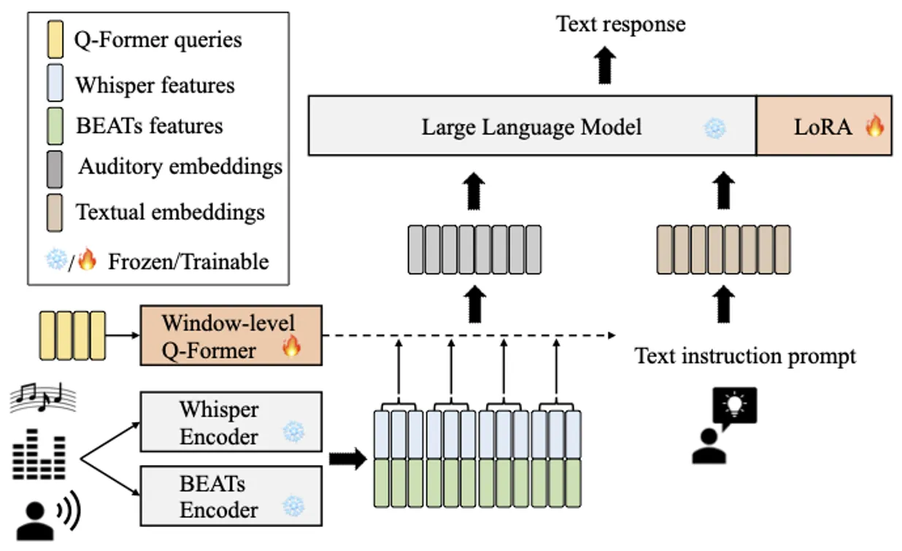
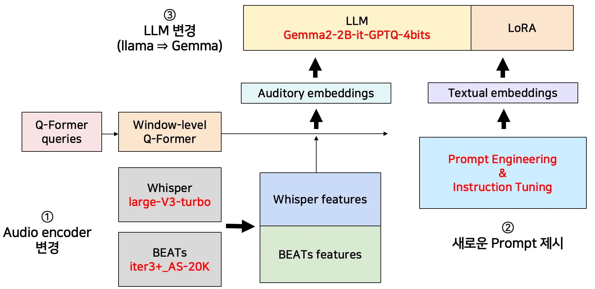

---
Protfolio:
aliases:
  - 오디오 언어모델의 경량 모델링 레서피 탐구
sticker: emoji//1f518
---
![[attachment/Portfolio/nota.png]]

## 1. 프로젝트 개요

Audio adapter와 사전학습 기법의 발전으로, 언어 모델은 음성, 음악, 환경음을 이해하고 다양한 오디오 기반 태스크를 수행할 수 있게 되었습니다. 다만 대규모 Audio LLM은 **메모리 사용량과 추론 지연 시간**으로 인해 On-device 환경 적용에 제약이 존재했습니다.

프로젝트는 SALMONN 기반 Audio LLM을 대상으로, **베이스라인 성능을 유지하면서 Memory와 Latency를 낮추는 경량화 레서피**를 실험적으로 탐구하였습니다. 모바일 GPU 환경을 가정하여 **ASR≈0.05, Memory≤6GB, TTFT≤1s, TPOT≤0.1s**를 목표 지표로 설정하였습니다.

## **2. 사용한 스킬 & 도구**

- **Language**: Python
- **Data / Analysis**: Pandas, NumPy, Jupyter Notebook
- **AI/ LLM Tools**: SALMONN(Whisper, BEATs, window-level LoRa)
- **Collaboration**: Git, Notion

## **3. 프로젝트 접근 및 실험 전략**

**문제 정의**: Nota에서 제공한 SALMONN 모델의 베이스 라인 성능을 유지하면서 Memory usage를 줄이고 Latency를 줄이는 것을 해커톤의 목표로 설정했습니다.

우리는 모델을 직접 경량화하기보다, **구성 요소 단위(LLM / Audio Encoder / Prompt / Q-Former / LoRA)**로 교체, 수정 실험을 분리하여 수행하였습니다. 각 실험은 성능(AAC, ASR)과 효율(Memory, Latency, TTFT, TPOT)의 변화를 동일 기준에서 비교하고, 목표 조건을 만족하는 조합을 최종 구성으로 선택하였습니다.

On-device가 가능한 모바일 GPU의 대략적인 기준인 **ASR ~0.05, Memory ~6GB, TTFT ~1 sec, TPOT ~0.1 sec**을 목표를 설정

### **3-1. Audio Encoder 교체**

Whisper-large-v2 → Whisper-large-v3-turbo, BEATs-iter3+_AS-2M → BEATs-iter3+_AS-20K로 교체한 결과, **성능(AAC/ASR)과 효율 지표 일부에서 개선이 확인되어** 최종 후보로 채택하였습니다.

| **Model**                                 | **AAC↑**   | **ASR ↓**  | **Memory↓**   | **Latency↓**   | **TTFT↓**      | **TPOT↓**      |
| ----------------------------------------- | ---------- | ---------- | ------------- | -------------- | -------------- | -------------- |
| llama-3B-instruct(5)                      | 0.1660     | 0.0886     | **9.1761 GB** | 0.3483 sec     | 0.3006 sec     | 0.0477 sec     |
| llama-3B-instruct-change-audio encoder(5) | **0.2100** | **0.0813** | 9.1771 GB     | **0.3374 sec** | **0.2902 sec** | **0.0472 sec** |

### **3-2. Prompt Engineering**

ASR과 AAC의 오류 사례(의도와 다른 태스크 수행, 의미 없는 구절 반복, 문맥 오류)를 분석하고, 출력 제약 및 문맥 기반 선택 지시를 추가한 프롬프트를 적용하였습니다. 그 결과 **추가 파라미터 없이 AAC 개선이 확인되어** 입력 설계의 영향도를 검증하였습니다.

| **Model**                             | **AAC↑**   | **ASR ↓**  |
| ------------------------------------- | ---------- | ---------- |
| Baseline                              | 0.1660     | 0.0886     |
| Prompt Engineering&Instruction Tuning | **0.2287** | **0.0899** |

### **3-3. LLM 교체 및 양자화**

llama 계열(3B/1B/GPTQ 4bit)과 타 LLM(deepseek, Vicuna, Gemma2)을 비교한 결과, **Gemma2-2B-it + GPTQ-4bit**가 메모리 6GB 이하 조건을 만족하면서 성능 하락을 최소화하는 선택지로 판단하였습니다.

| **Model**                    | **AAC↑** | **ASR ↓** | **Memory↓** | **Latency↓** | **TTFT↓**  | **TPOT↓**  |
| ---------------------------- | -------- | --------- | ----------- | ------------ | ---------- | ---------- |
| Baseline                     | 0.2027   | 0.0634    | 9.1761 GB   | 0.2511 sec   | 0.2061 sec | 0.0450 sec |
| Gemma2-2B-it + GPTQ-4bit(20) | 0.2674   | 0.0641    | 5.3169 GB   | 0.4622 sec   | 0.3540 sec | 0.1082 sec |

### **3-4. Q-Former 경량화 시도 (실패 사례)**

Attention head 수를 절반으로 축소하여 연산량 감소를 시도했으나, **Memory/Latency 개선 폭이 미미한 반면 성능 하락이 커 최종 구성에서는 제외하였습니다.** 이를 통해 일부 구조적 경량화는 전체 시스템 관점에서 비효율적일 수 있음을 확인하였습니다.

|**Model**|**AAC↑**|**ASR ↓**|**Memory↓**|**Latency↓**|**TTFT↓**|**TPOT↓**|
|---|---|---|---|---|---|---|
|llama-3B-instruct(5)|**0.2287**|**0.0889**|9.1761 GB|0.3483 sec|0.3006 sec|0.0477 sec|
|llama-3B-instruct-Modified-MHA(5)|0.2146|0.1006|**9.1217 GB**|**0.3457 sec**|**0.2985 sec**|**0.0472 sec**|

## **4. 결과 및 성과**

  

 

<strong> SALMONN</strong>

  

<strong> CV - 03 Model</strong>

  

| **Model** | **AAC↑**   | **ASR ↓**  | **Memory↓**   | **Latency↓**   | **TTFT↓**      | **TPOT↓**      |
| --------- | ---------- | ---------- | ------------- | -------------- | -------------- | -------------- |
| Baseline  | 0.2027     | 0.0634     | 9.1761 GB     | 0.2511 sec     | 0.2061 sec     | 0.0450 sec     |
| Our Model | **0.3049** | **0.0642** | **5.3169 GB** | **0.4627 sec** | **0.3555 sec** | **0.1072 sec** |

Audio Encoder 교체 + Prompt 개선 + LLM 변경을 결합한 최종 구성에서 **Memory는 9.176GB → 5.317GB로 감소**, **AAC는 0.2027 → 0.3049로 향상**, **ASR은 0.0634 → 0.0642로 유사 수준**을 유지하였습니다.

## **5. 나의 역할**

프로젝트에서는 특정 모듈을 전담하기보다는 실험 진행이 지연되거나 경량화 효과가 명확하지 않은 구간에 참여하여 설정과 결과를 함께 점검하고 실험을 이어가는 역할을 수행하였습니다.

LLM 교체 실험, Audio Encoder 변경, Prompt Engineering 등 여러 단계에 관여하며 **각 실험이 중단되지 않고 비교 가능한 결과로 정리될 수 있도록 보조하였습니다.**

특히 실험 결과를 성능(AAC, ASR)과 효율(Memory, Latency) 관점에서 정리하고 최종 구성에서 채택, 제외 여부를 판단하는 논의 과정에 참여하였습니다.

## **6. 회고**

프로젝트에서 우리 팀과 상위 성과를 낸 팀은 모두 오디오 언어 모델의 경량화를 목표로 접근했지만, **문제를 바라보는 관점과 전략에서 차이가 존재했습니다.**

우리 팀은 **전체 파이프라인의 성능을 빠르게 개선하는 데 초점을 맞추어, 모델 구성 요소를 교체하며 성능과 효율의 균형을 탐색하는 방식**을 선택했습니다. LLM과 오디오 인코더를 다양한 후보로 교체, 비교하고, 양자화 기법과 프롬프트 설계 등을 병행하여 성능 개선 가능성을 폭넓게 실험하였습니다. 이 과정에서 일부 직접적인 경량화 시도는 성능 저하나 구현 난이도로 인해 최종 결과로 이어지지 못했으나, 다양한 조합에 대한 특성을 확인할 수 있었습니다.

반면 상위 성과를 낸 팀은 **경량화 문제를 파이프라인을 구성 요소별로 정량 분석하는 관점**에서 접근하였습니다. 전체 모델에서 가장 큰 비중을 차지하는 요소를 먼저 식별하고, 해당 영역에 전략을 집중하는 방식으로 메모리 사용량과 지연 시간을 효과적으로 줄였습니다. 이러한 접근은 제한된 시간과 자원 환경에서 특히 효율적인 전략임을 확인할 수 있었습니다.

이번 프로젝트를 통해, 경량화 과제에서는 단순히 더 가벼운 모델을 찾는 것뿐 아니라, 전체 파이프라인을 수치적으로 분해하고 가장 큰 비용을 차지하는 지점을 정확히 정의한 뒤 그 부분을 직접적으로 줄이는 전략의 중요성을 인식하게 되었습니다. 향후 유사한 과제에서는 초기 단계에서 병목 요소를 정량적으로 규명하고, 이를 중심으로 실험 전략을 설계하는 접근을 적용할거 같습니다.

## 7. 관련 링크 및 코드

### **Git**

### **PDF**